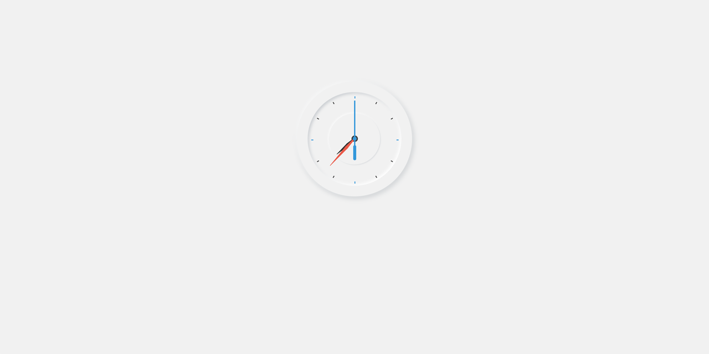
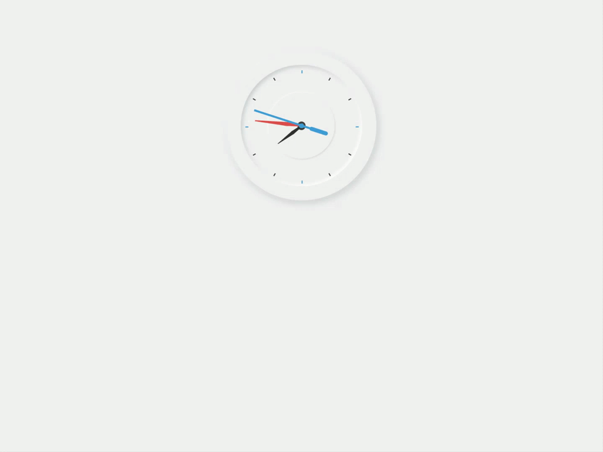

<p id="header"><p>

<table><tr>
<td> <a href="https://github.com/emjose/kinetic-loader-2/#header"></a> </td>
<td> <a href="https://github.com/emjose/one-hundred/#header"></a> </td>
<td> <a href="https://github.com/emjose/analog-clock-2/#header"></a> </td>
</tr></table>

<br>

<p id="project-title"><p>

<a href=#table-of-contents></a> 

<br>

<a href="https://emjose.github.io/analog-clock-1/"></a> 

#

<p id="table-of-contents"><p>

<a href=#table-of-contents></a>  

- [100 Days of Code](#100days)
- [Installation](#installation) 
- [Live Site](#live-site)
- [Resources](#resources)
- [Let's Connect!](#lets-connect) 

#

<p id="100days"><p>

<a href=#100days></a>  

### Day 8: February 11, 2021
- I love analog clocks, and I looked up tutorials on how to make clocks with JavaScript, HTML, and CSS.

- This clock has a <a href="https://medium.com/@artofofiare/neumorphism-the-right-way-a-2020-design-trend-386e6a09040a#:~:text=Neumorphism%20(or%20Neo%2Dskeuomorphism),New%E2%80%9D%20and%20%E2%80%9CSkeuomorphism%E2%80%9D.">neumorphism</a> design style, which is defined by forms protruding from or imprinting on a surface. See <a href="https://github.com/emjose/analog-clock-2/#header">second clock project</a>.

#

<p id="installation"><p>

<a href=#installation></a>

#### Git clone and cd into the repo folder:
``` 
git clone git@github.com:emjose/analog-clock-1.git && cd analog-clock-1
```
#### Run the command:
```
open index.html
```

#

<p id="live-site"><p>

<a href="https://emjose.github.io/analog-clock-1/"></a>  

<a href="https://emjose.github.io/analog-clock-1/"></a>

#

<p id="resources"><p>

<a href=#resources></a>  

- #### [50 Projects in 50 Days](https://50projects50days.com/)

- #### [Neumorphism Generator](https://neumorphism.io/) by [Adam Giebl](https://github.com/adamgiebl)

- #### [Neumorphism Analog Clock Tutorial](https://youtu.be/NVoIEEb0Hqg) by [CodingNepal](https://www.youtube.com/channel/UCk7xIEmd3MeyhIu2StLX5yA)

- #### [Neumorphism the Right Way — A 2020 Design Trend](https://medium.com/@artofofiare/neumorphism-the-right-way-a-2020-design-trend-386e6a09040a#:~:text=Neumorphism%20(or%20Neo%2Dskeuomorphism),let's%20look%20at%20%E2%80%9CSkeuomorphism%E2%80%9D.)

- #### [Theme Clock Tutorial from the 50 Projects in 50 Days Udemy Course](https://www.udemy.com/course/50-projects-50-days/)

#

<p id="lets-connect"><p>

<a href=#lets-connect></a>

<p><a href="https://twitter.com/Emmanuel_Labor"> <a href="https://www.linkedin.com/in/emmanuelpjose/"> <a href="https://emmanueljose.medium.com/"> <a href="https://www.instagram.com/emmanuel_jose/"> <a href="mailto:emjose@gmail.com"> <a href="https://www.youtube.com/channel/UCQdqFg-_J83jn9xJRd1W3tQ/videos"> <a href="https://github.com/emjose"></p>

#

<a href=#header></a>